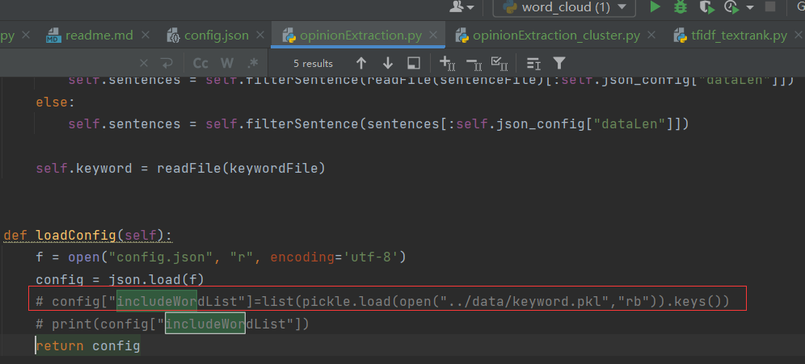
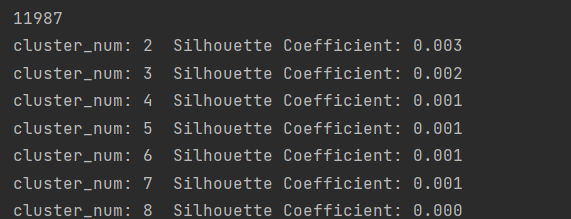

1、hotel_review.txt数据地址：https://raw.githubusercontent.com/SophonPlus/ChineseNlpCorpus/master/datasets/ChnSentiCorp_htl_all/ChnSentiCorp_htl_all.csv

2、外卖数据waimai.txt对应：https://raw.githubusercontent.com/SophonPlus/ChineseNlpCorpus/master/datasets/waimai_10k/waimai_10k.csv

###环境配置
pyhanlp==0.1.44
tensorflow==2.0.0
## 情感分析
0、>python data/process_data.py将数据划分为训练集、测试集、验证集。其中1，代表积极，0代表消极
1、运行train_word2vec.py训练词向量
2、运行text_train.py用textcnn训练
3、运行text_test.py判断测试集准确率、召回率等。
##提取关键词绘制词云图
先分词，再tfidf和textrank结合选取关键词，最后根据关键词的权重绘制词云图。

>python word_cloud.py

输出为data/output.png就是绘制的词云图，data/keyword.pkl就是保存的keyword有权重的关键字

## 观点提取
1、通过依存句法分析，提取重要的“动补结构”，“介宾关系‘，”动宾关系“，根据关键词来找到所在部分，后根据核心词提取观点。
可以提取含多个关键词的观点，利用上述重要的关系将提取出的词拼接成观点。使用O(n^2)的方法分别以每个观点为中心判断和其他观点使用difflib的距离进行聚类，并最后
根据最高出现次数的字拼接求和各观点的相似度，最相似的作为聚类的代表。
>python option_extraction/process_to_list.py

每一行为一个评论，将所有评论写到sentence.txt同时单独将负面评论写到sentence_neg.txt
>python option_extraction/main.py

默认输入文件为sentence_neg.txt，可以修改为sentence.txt

config.json文件是一些配置参数：datalen限制评论长度为1000，去除包含exceptWordList的评论，includeWordList作为关键词，
minOptionLen对应为评论最小长度为4，minClusterLen对应为最小聚类数目为3，freqStrlen对应找聚类代表时最高词频必须要大于的数值，
thresholds为[0.2，0.7]即高于0.2算作一类，后对处理的结果再以高于0.7算作一类，以节省时间。

其中includeWordList可以改为tfidf和textrank结合的算法提取的关键词列表。

红线框中的取消注释即可。
结果为

总之使用tfidf和textrank结合的方法找出关键词和对应权重，绘制词云图，并将关键词输入到
依存句法分析提取观点的参数配置中，聚类后找到每一类的代表，从大到小输出，效果较好。
其中要控制输出类的数量需要更改opinion_extraction的config.json的阈值等参数。

-----------------------------------------------------------

##效果不好的聚类
对于句子聚类，使用gensim的doc2vec包直接转为句子向量，在用kmeans进行聚类时，效果不好，Silhouette Coefficient接近于0，
对应的是运行doc2vec_gensim.py。模型保存到了d2v.model
说明了保留标签则是相当重要的

###使用tfidf的AF聚类算法
AP算法不需要先确定聚类的数目，而是把所有的数据点都看成潜在意义上
的聚类中心（exemplar）。这里通过词向量和词向量对应的tf-idf 值构建文本向量表示，文本之间的相似性通过两个文本向
量的余弦相似性得到。最后通过AP聚类算法得到观点数量，并从观点中筛选典型评论
>python tfidf_ap.py

AP算法虽然不需要指定聚类数量，但由于算法复杂度高，较慢，且有时并不一定会收敛。在此数据集上表现不佳。依赖于每个句子的向量化表示。
